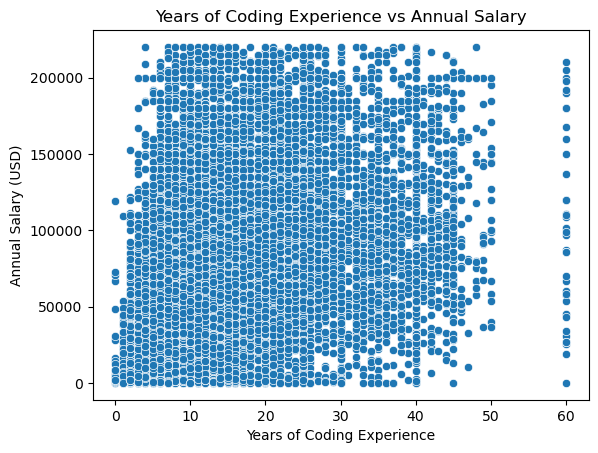
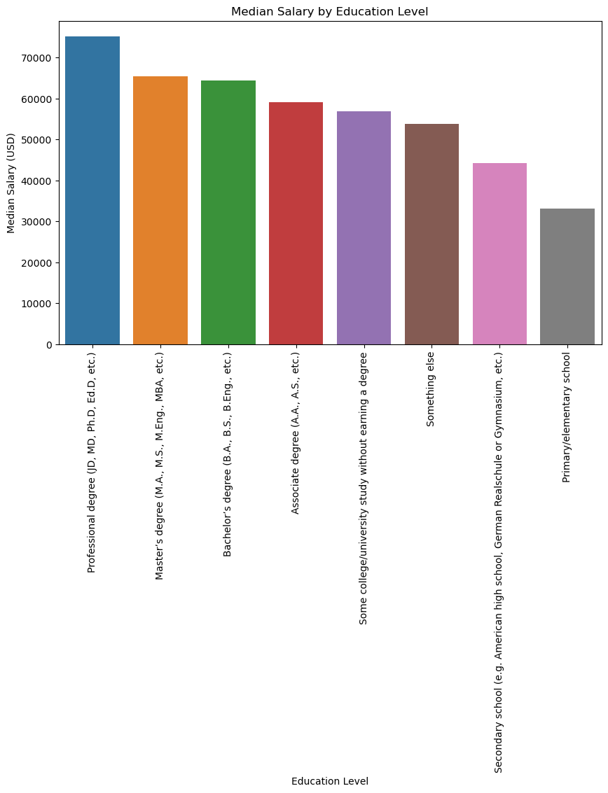
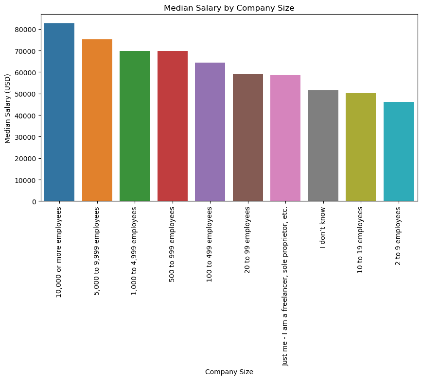
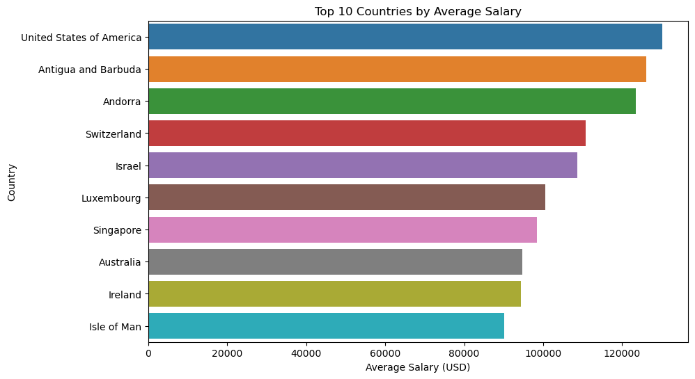

# What Drives Developer Salaries?
*Insights from the Stack Overflow Developer Survey*

# Discovering & Predicting Tech Salaries from the 2024 Stack Overflow Survey

*Project: Exploring and predicting employee salaries using 2024 Stack Overflow survey responses*

Modern compensation strategy can’t run on hunches. This post distills what we learned from the 2024 Stack Overflow survey and sets up a practical path to prediction. We framed the work around four simple questions stakeholders ask most often: **Does experience pay? Does education matter? Do bigger companies pay more? Which countries lead?** Each section below answers the question and includes a clear marker showing where to place the corresponding chart.

---

## Q1) How does years of coding experience relate to annual salary?

<!-- INSERT GRAPH 1 HERE: Years of Coding Experience vs. Annual Salary -->

**What we found**  
Experience helps, but it’s not a straight line. Salaries tend to rise as years of coding accumulate, especially through mid–senior levels. However, the dispersion is wide at every tenure band—new grads and veterans alike share overlapping ranges. That spread is explained by role scope (IC vs. lead/manager), specialization (ML/AI, platform, security), company size, and—most of all—location.

**So what?**  
For hiring and compensation, don’t over-index on tenure. Benchmark by **role** and **market**, with tenure as a refinement. In modeling, years of experience is useful but insufficient; it must be paired with structural features like geography and company size to predict well.

---

## Q2) Does education level meaningfully change pay?

<!-- INSERT GRAPH 2 HERE: Median Salary by Education Level -->

**What we found**  
Median salary steps up with education. Professional and master’s degrees occupy the top of the distribution; bachelor’s degrees follow closely; secondary/primary schooling sit at the bottom. The effect is strongest in research-heavy disciplines (data science, ML, infra research).

**So what?**  
Treat education as a **signal**, not a gate. Use it to fine‑tune salary bands—especially for research or advanced analytics roles—while still grounding offers in role seniority, market rates, and demonstrated impact.

---

## Q3) Do larger companies pay more?

<!-- INSERT GRAPH 3 HERE: Median Salary by Company Size -->

**What we found**  
Yes—on average, pay rises with company size, peaking among organizations with **10,000+** employees. Very small teams and freelancers show lower medians and more volatility, while mid‑market firms land in between. This reflects deeper resources, brand premiums, and aggressive competition for senior talent in the enterprise segment.

**So what?**  
If we’re mid‑sized and need senior engineers, we should budget for selective premiums or compete on non‑cash advantages (equity growth, flexible work, internal mobility, learning budgets). In the model, **company size** is a high‑signal categorical feature and should be included early.

---

## Q4) Which countries pay the highest average salaries?

<!-- INSERT GRAPH 4 HERE: Top 10 Countries by Average Salary -->

**What we found**  
The **United States** leads in our sample, followed by **Antigua and Barbuda**, **Andorra**, **Switzerland**, and **Israel**, with several advanced economies (Luxembourg, Singapore, Australia, Ireland) also ranking high. Differences reflect cost of living, currency strength, taxation, and the local tech mix (finance, biotech, big‑tech hubs).

**So what?**  
Geography is a primary driver of pay. For distributed teams, anchor offers to **local market benchmarks** rather than a single global band. For modeling, encode country (or region) and, where available, remote vs. on‑site status to capture geography’s effect.

---

## From exploration to prediction

Our EDA identifies **four foundational features** for a salary model: **geography, company size, education level,** and **years of coding experience**. We will augment these with role/specialization, employment type, and industry where available. A regularized tree‑based approach (e.g., Gradient Boosting/XGBoost) will let us handle non‑linearities and interactions without heavy feature engineering.

- **Evaluation:** Cross‑validation with MAE/MAPE targets and robust outlier handling (winsorization/capping).  
- **Explainability:** SHAP values to communicate how each feature shifts a prediction.  
- **Fairness checks:** Ensure the model captures market structure (e.g., geography, size) rather than proxies for bias.

---

## Caveats and data notes

- **Self‑reported survey data** implies noise and occasional extreme values; we mitigate with cleaning and reasonable caps.  
- **Currencies and cost‑of‑living** vary widely; for policy decisions, pair the model with PPP/COL adjustments.  
- **Role heterogeneity:** “Developer” spans many jobs; more granular role labels materially improve accuracy.

---

## What stakeholders should do next

1. **Adopt location‑ and size‑aware pay bands** for priority roles.  
2. **Use education as a refinement**, not a hard filter.  
3. **Prioritize mid‑senior experience hires** where ROI on compensation is strongest.  
4. **Ship the first predictor** and publish an internal dashboard that estimates market‑aligned salary ranges based on **location, company size, education,** and **experience**. Stakeholders can then “toggle” inputs and compare scenarios before making offers.

*Questions or feedback?* We’ll incorporate them into the next model iteration and expand the feature set as additional survey fields (role, industry, remote status) are validated.
